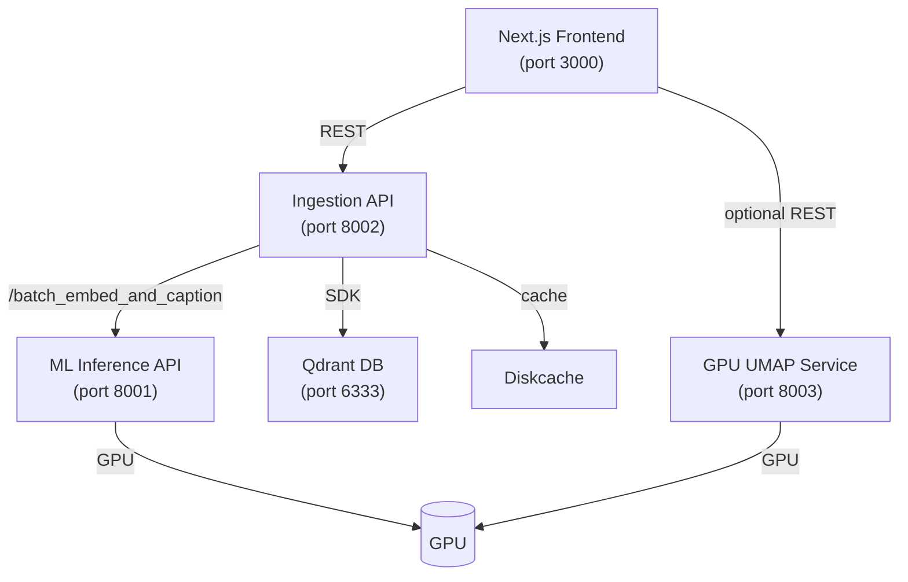
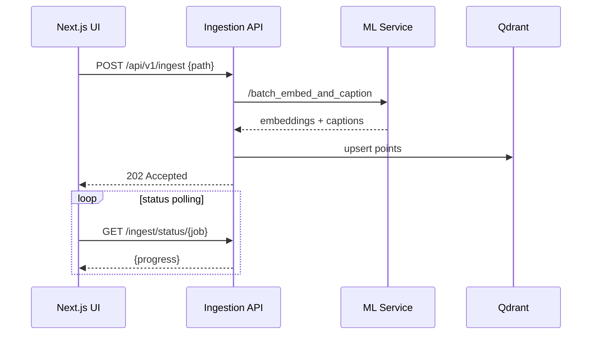
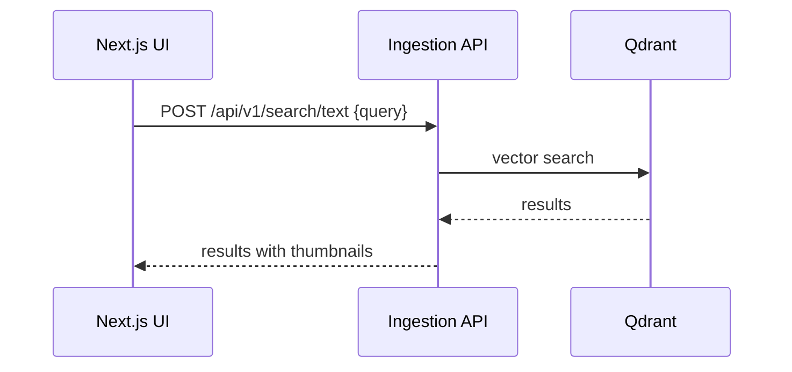
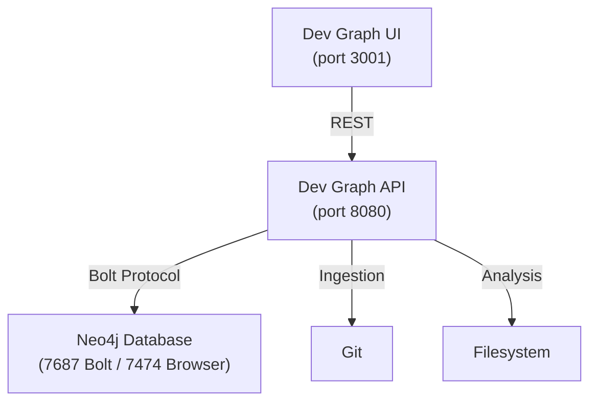

# Vibe Coding - Dual Platform Architecture

## Overview

This repository contains two distinct, production-ready AI applications sharing common infrastructure but serving different purposes:

1. **Pixel Detective** - AI-powered media search engine
2. **Dev Graph** - Temporal knowledge graph for code evolution

Both applications follow modern microservices architecture principles with FastAPI backends, Next.js frontends, and specialized databases.

---

## 🎨 **Pixel Detective Architecture**

### **System Overview**

Pixel Detective is a self-hosted media search platform built with a microservices backend and a Next.js frontend. All services communicate via HTTP and share a common Qdrant vector database for persistent storage.

### **Service Topology**



### **Backend Services**

#### **1. Ingestion Orchestration API** (Port 8002)
- **Purpose**: Coordinate image processing pipeline
- **Location**: `backend/ingestion_orchestration_fastapi_app`
- **Key Responsibilities**:
  - Scan image directories and generate thumbnails
  - Call ML service for embeddings and captions
  - Upsert data into Qdrant vector database
  - Manage collections and metadata
  - Track job progress and caching
- **Documentation**: [README](backend/ingestion_orchestration_fastapi_app/README.md)

#### **2. ML Inference API** (Port 8001)
- **Purpose**: Host AI models for embeddings and captioning
- **Location**: `backend/ml_inference_fastapi_app`
- **Key Responsibilities**:
  - CLIP model hosting (vision-language embeddings)
  - BLIP model hosting (image captioning)
  - Batch processing for efficiency
  - GPU memory management
  - Model capability reporting
- **Documentation**: [README](backend/ml_inference_fastapi_app/README.md)

#### **3. GPU-UMAP Service** (Port 8003)
- **Purpose**: GPU-accelerated dimensionality reduction and clustering
- **Location**: `backend/gpu_umap_service`
- **Key Responsibilities**:
  - UMAP projections using RAPIDS cuML
  - DBSCAN clustering
  - K-Means clustering
  - Real-time streaming updates
  - GPU resource optimization
- **Documentation**: [README](backend/gpu_umap_service/README.md)

#### **4. Qdrant Vector Database** (Port 6333)
- **Purpose**: Vector similarity search and metadata storage
- **Deployment**: Docker container
- **Configuration**: `docker-compose.yml`
- **Key Features**:
  - Persistent vector storage
  - Efficient similarity search
  - Metadata filtering
  - Collection management

#### **5. Disk Cache**
- **Location**: `backend/ingestion_orchestration_fastapi_app/.diskcache`
- **Purpose**: Deduplication and job tracking
- **Benefits**: Avoid re-processing identical images

### **Service Interactions**

#### **Startup Sequence**
1. Ingestion service queries `/api/v1/capabilities` on ML service
2. Determines safe batch sizes for GPU operations
3. Establishes connection to Qdrant database

#### **Ingestion Workflow**


#### **Search Flow**


### **Frontend Architecture**

- **Location**: `frontend/`
- **Framework**: Next.js 15 (App Router)
- **UI Library**: Chakra UI
- **State Management**: React Query + Zustand
- **API Client**: Axios (`src/lib/api.ts`)

#### **Key Screens**
- **Home Dashboard** - `src/app/page.tsx`
- **Collections** - `src/app/collections/page.tsx`
- **Search** - `src/app/search/page.tsx`
- **Latent Space** - `src/app/latent-space/`

#### **Data Flow**
```
User Action → React Query → Axios API Client → Backend Service
                  ↓
            Zustand Store (UI state)
                  ↓
            React Components
```

### **Performance Characteristics**

- **Search Latency**: Sub-second for 100K+ images
- **GPU Acceleration**: 10× faster than CPU
- **UMAP Rendering**: 1K points < 3 seconds on consumer GPUs
- **Memory Footprint**: < 100 MB frontend, dynamic backend based on models
- **Concurrent Processing**: Multiple collections simultaneously

---

## 🗺️ **Dev Graph Architecture**

### **System Overview**

Dev Graph is a temporal semantic knowledge graph that tracks code evolution by linking git commits, code symbols, documentation, and requirements into Neo4j.

### **Service Topology**



### **Backend Service**

#### **Dev Graph API** (Port 8080)
- **Purpose**: Knowledge graph construction and querying
- **Location**: `developer_graph/`
- **Main Module**: `api.py`

**Key Components**:

1. **Temporal Engine** (`temporal_engine.py`)
   - Git history ingestion
   - Commit ordering relationships
   - File evolution tracking

2. **Code Symbol Extractor** (`code_symbol_extractor.py`)
   - Extract Python/TypeScript/JavaScript symbols
   - Create DEFINED_IN relationships
   - Link symbols to documentation

3. **Document Code Linker** (`document_code_linker.py`)
   - Link documentation chunks to code files
   - Create MENTIONS relationships
   - Path-based discovery

4. **Relationship Deriver** (`relationship_deriver.py`)
   - Derive IMPLEMENTS relationships (requirement→file)
   - Create EVOLVES_FROM links (requirement evolution)
   - Infer DEPENDS_ON from imports

5. **Sprint Mapping** (`sprint_mapping.py`)
   - Map commits to sprint windows
   - Link documents to sprints
   - Create INCLUDES relationships

**API Routers** (`routes/`):
- `unified_ingest.py` - 8-stage ingestion pipeline
- `commits_timeline.py` - Temporal queries
- `search.py` - Full-text search
- `graph.py` - Graph visualization
- `analytics.py` - Statistics and metrics
- `quality.py` - Data quality checks

### **Data Model**

#### **Node Types**
```cypher
// Core Entities
(:GitCommit {hash, message, author, timestamp})
(:File {path, type, size, encoding})
(:Document {path, title, type})
(:Chunk {content, kind, doc_path})

// Code Structure
(:Symbol {name, kind, signature, file_path})
(:Library {name, language, manifest_sources})

// Planning & Requirements
(:Requirement {id, type, description, status})
(:Sprint {number, name, start_date, end_date})

// System Metadata
(:DerivationWatermark {stage, timestamp})
```

#### **Relationship Types**
```cypher
// Git & Files
(:GitCommit)-[:TOUCHED {timestamp}]->(:File)
(:GitCommit)-[:NEXT_COMMIT]->(:GitCommit)
(:GitCommit)-[:PREV_COMMIT]->(:GitCommit)
(:File)-[:CO_OCCURS_WITH {count}]->(:File)

// Documentation
(:Document)-[:CONTAINS_CHUNK]->(:Chunk)
(:Chunk)-[:PART_OF]->(:File)
(:Chunk)-[:MENTIONS]->(:Requirement)
(:Chunk)-[:MENTIONS_SYMBOL]->(:Symbol)
(:Chunk)-[:MENTIONS_FILE]->(:File)
(:Chunk)-[:MENTIONS_COMMIT]->(:GitCommit)
(:Chunk)-[:MENTIONS_LIBRARY]->(:Library)

// Code Structure
(:Symbol)-[:DEFINED_IN]->(:File)
(:File)-[:IMPORTS]->(:File)
(:File)-[:USES_LIBRARY]->(:Library)

// Requirements & Implementation
(:Requirement)-[:PART_OF]->(:Sprint|:Document)
(:Requirement)-[:IMPLEMENTS]->(:File)
(:Requirement)-[:EVOLVES_FROM]->(:Requirement)
(:File)-[:DEPENDS_ON]->(:File)

// Sprint Management
(:Sprint)-[:INCLUDES]->(:GitCommit)
(:Sprint)-[:INVOLVES_FILE]->(:File)
```

### **Ingestion Pipeline**

The unified ingestion pipeline consists of 8 stages:

**Stage 1: Git History**
- Ingest commits with full metadata
- Create commit ordering (NEXT/PREV)
- Link commits to files (TOUCHED)

**Stage 2: Documentation**
- Discover markdown/text documents
- Extract metadata and titles
- Create Document nodes

**Stage 3: Chunking**
- Split documents into semantic chunks
- Create Chunk nodes
- Link chunks to documents and files

**Stage 4: Requirements**
- Extract requirements from documents and commits
- Create Requirement nodes
- Link to parent documents/sprints

**Stage 5: Code Symbols**
- Extract classes, functions, methods
- Create Symbol nodes
- Link to source files (DEFINED_IN)

**Stage 6: Sprint Mapping**
- Parse SPRINT_STATUS.md
- Create Sprint nodes
- Link commits to sprints (INCLUDES)

**Stage 7: Library Discovery**
- Parse package.json, requirements.txt
- Create Library nodes
- Link files to libraries (USES_LIBRARY)

**Stage 8: Semantic Linking**
- Link chunks to symbols (MENTIONS_SYMBOL)
- Link chunks to files (MENTIONS_FILE)
- Link chunks to commits (MENTIONS_COMMIT)
- Derive implementation relationships

### **Frontend Architecture**

- **Location**: `tools/dev-graph-ui/`
- **Framework**: Next.js 14 (App Router)
- **UI Library**: Chakra UI
- **Visualization**: DeckGL + Three.js (WebGL2)
- **State Management**: React Query

#### **Key Screens**
- **Home** - Overview and quick actions
- **Timeline** - WebGL commit history visualization
- **Structure** - Code hierarchy explorer
- **Search** - Full-text graph search
- **Analytics** - Statistics and metrics

#### **WebGL Timeline**
- **Rendering Engine**: DeckGL ScatterplotLayer
- **Performance**: 60 FPS with 10K+ nodes
- **Interactivity**: Play/pause, node selection, zoom
- **Adaptive Budget**: Automatic LOD based on device

### **Current Scale**

- **Total Nodes**: 30,822
- **Total Relationships**: 255,389
- **Quality Score**: 100.0%
- **Orphaned Nodes**: < 10

#### **Node Breakdown**
| Type | Count | % |
|------|-------|---|
| Symbol | 13,892 | 45.1% |
| Chunk | 13,829 | 44.9% |
| File | 2,461 | 8.0% |
| GitCommit | 290 | 0.9% |
| Document | 174 | 0.6% |
| Library | 97 | 0.3% |
| Requirement | 64 | 0.2% |
| Sprint | 12 | 0.04% |

---

## 🔄 **Shared Infrastructure**

### **Docker Services**

**docker-compose.yml** defines:
- `qdrant_db` - Qdrant for Pixel Detective
- `neo4j_db` - Neo4j for Dev Graph
- Network configuration
- Volume mounts
- Environment variables

### **Common Utilities** (`utils/`)
- `logger.py` - Structured logging
- `cuda_utils.py` - GPU utilities
- `metadata_extractor.py` - EXIF extraction
- `embedding_cache.py` - Disk cache
- `duplicate_detector.py` - SHA256 hashing

### **Shared Database Module** (`database/`)
- `qdrant_connector.py` - Qdrant client wrapper
- `db_manager.py` - Generic DB utilities

### **Configuration** (`config.py`)
- Environment variable management
- Service URL configuration
- Default settings

---

## 🚀 **Deployment**

### **Development**

```bash
# Pixel Detective
.\start_pixel_detective.ps1

# Dev Graph
.\start_dev_graph.ps1
```

### **Production Considerations**

#### **For Pixel Detective**
- Scale ML inference service horizontally
- Use persistent Qdrant volumes
- Configure GPU resource limits
- Implement authentication
- Set up CDN for thumbnails

#### **For Dev Graph**
- Configure Neo4j authentication
- Set up incremental ingestion triggers
- Implement API rate limiting
- Cache expensive queries
- Set up backup/restore procedures

### **Resource Requirements**

#### **Minimum (CPU-only)**
- 8 GB RAM
- 4 CPU cores
- 50 GB disk space
- No GPU required (CPU fallback)

#### **Recommended (GPU)**
- 16 GB RAM
- 8 CPU cores
- NVIDIA GPU with 8+ GB VRAM
- 100 GB disk space
- CUDA 11.8+

---

## 📊 **Monitoring & Observability**

### **Health Endpoints**

**Pixel Detective**:
- `http://localhost:8001/health` - ML service
- `http://localhost:8002/health` - Ingestion service
- `http://localhost:8003/health` - GPU-UMAP service

**Dev Graph**:
- `http://localhost:8080/api/v1/dev-graph/health` - API health
- `http://localhost:7474` - Neo4j browser

### **Metrics**

Both applications expose:
- Request latency
- Error rates
- Resource utilization
- Cache hit rates
- Database connection status

### **Logging**

Structured logging with:
- **Level**: DEBUG, INFO, WARNING, ERROR
- **Context**: Request ID, user, service
- **Format**: JSON for production, colored for development

---

## 🔐 **Security Considerations**

### **Current State (Development)**
- No authentication required
- Services bound to localhost
- Default credentials

### **Production Recommendations**
1. **Authentication**: Implement JWT or OAuth2
2. **HTTPS**: TLS for all communications
3. **Secrets Management**: Use vault or env variables
4. **Network Isolation**: Private networks for services
5. **Input Validation**: Sanitize all user inputs
6. **Rate Limiting**: Prevent abuse
7. **Audit Logging**: Track all operations

---

## 📚 **Additional Resources**

### **Detailed Documentation**
- [Backend Architecture](backend/ARCHITECTURE.md)
- [Frontend Architecture](frontend/ARCHITECTURE.md)
- [Dev Graph Architecture](developer_graph/architecture.md)

### **API Documentation**
- Pixel Detective Ingestion: http://localhost:8002/docs
- Pixel Detective ML: http://localhost:8001/docs
- Pixel Detective UMAP: http://localhost:8003/docs
- Dev Graph: http://localhost:8080/docs

### **Development Guides**
- [Developer Guide](DEVELOPER_GUIDE.md)
- [Agent Guidelines](AGENTS.md)
- [Sprint Documentation](docs/sprints/)

---

**Last Updated**: Sprint 11 (September 2025)  
**Architecture Version**: 2.0 (Dual Platform)  
**Status**: Production Ready
