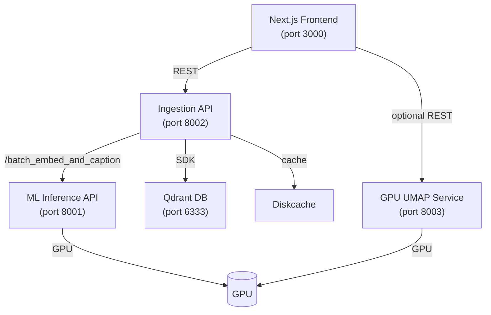
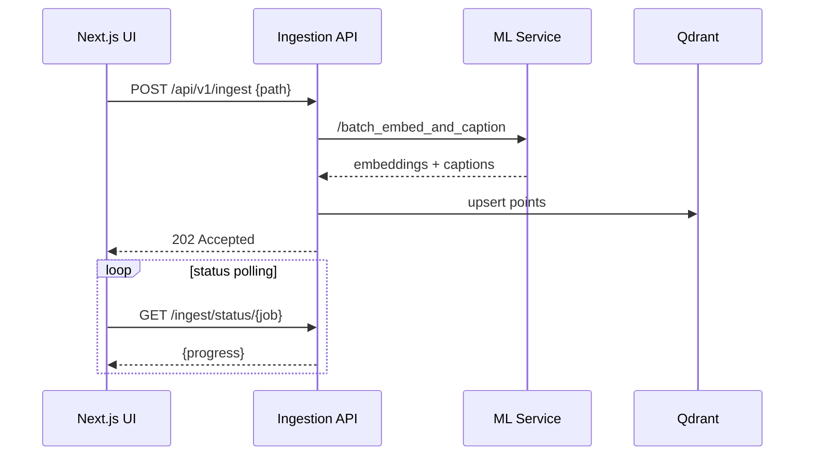
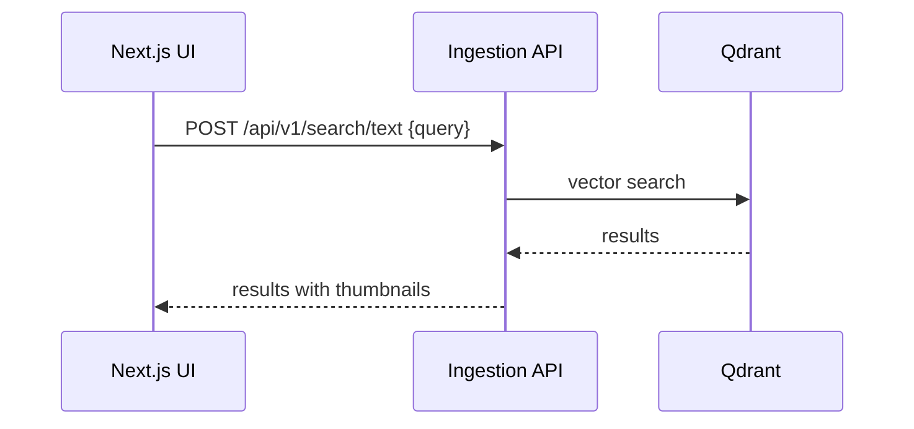

# Pixel Detective Architecture

## Overview
Pixel Detective is a self-hosted media search application built with a microservices backend and a Next.js frontend. All services communicate via HTTP and share a common Qdrant vector database for persistent storage.

## Backend

### Services
- **Ingestion Orchestration API** – `backend/ingestion_orchestration_fastapi_app` (FastAPI, port **8002**). Scans image directories, generates thumbnails, calls the ML service for embeddings and captions and upserts data into Qdrant. Documentation: [`backend/ingestion_orchestration_fastapi_app/README.md`](backend/ingestion_orchestration_fastapi_app/README.md).
- **ML Inference API** – `backend/ml_inference_fastapi_app` (FastAPI + PyTorch, port **8001**). Hosts CLIP and BLIP models, returning embeddings and captions for image batches. Documentation: [`backend/ml_inference_fastapi_app/README.md`](backend/ml_inference_fastapi_app/README.md).
- **GPU‑UMAP Service** – `backend/gpu_umap_service` (FastAPI + cuML, port **8003**). Provides GPU‑accelerated UMAP projections and clustering. Documentation: [`backend/gpu_umap_service/README.md`](backend/gpu_umap_service/README.md).
- **Qdrant Vector DB** – Docker container (port **6333**). Stores embeddings and metadata for similarity search. Configuration: [`docker-compose.yml`](docker-compose.yml).
- **Disk Cache** – `backend/ingestion_orchestration_fastapi_app/.diskcache` used by the ingestion service for deduplication and job tracking.

### Interaction
1. The ingestion service queries `/api/v1/capabilities` on the ML service at startup to determine safe batch sizes.
2. When ingestion runs, it sends images to `/api/v1/batch_embed_and_caption` on the ML service, then writes results to Qdrant.
3. The frontend accesses ingestion endpoints such as `/api/v1/search/text`, `/api/v1/collections`, and `/api/v1/images/{id}/thumbnail`.
4. For latent‑space clustering, the frontend optionally calls the GPU‑UMAP service; if it is unreachable, it falls back to endpoints on the ingestion service.

## Frontend

The frontend lives under `frontend/` and is a Next.js 15 application using React 18, Chakra UI and React Query. It communicates with the backend through an Axios client (`src/lib/api.ts`, referenced throughout the codebase) and keeps server state in React Query stores. See [`frontend/ARCHITECTURE.md`](frontend/ARCHITECTURE.md) for a full breakdown of the directory structure and component patterns.

Key screens:
- **Home dashboard** `src/app/page.tsx` – overall status and quick actions.
- **Collections** `src/app/collections/page.tsx` – manage and select collections.
- **Search** `src/app/search/page.tsx` – semantic text or image search.
- **Latent Space** `src/app/latent-space/` – UMAP visualization with clustering.

## Diagrams

### Service Topology


### Ingestion Workflow


### Search Flow


### Box Diagram (ASCII)
```
           +-------------------+
           |  Next.js Frontend |
           +---------+---------+
                     |
                     v
           +---------+---------+
           | Ingestion API     |
           +--+------------+---+
              |            |
              |            v
              |       +----+-----+
              |       | Diskcache|
              |       +----------+
              |            |
              v            v
       +------+----+  +----+-----+
       | ML API   |  | Qdrant DB |
       +------+---+  +----------+
              |           ^
              |           |
              |    optional REST
              +---> GPU UMAP Service
```

## Useful Files
- [`backend/ARCHITECTURE.md`](backend/ARCHITECTURE.md) – detailed backend specification and API tables.
- [`frontend/ARCHITECTURE.md`](frontend/ARCHITECTURE.md) – frontend structure, state management and data flow.
- [`docs/`](docs/) – project history, sprint notes and additional guides.
- [`tests/`](tests/) – pytest suite covering ingestion workflows.
