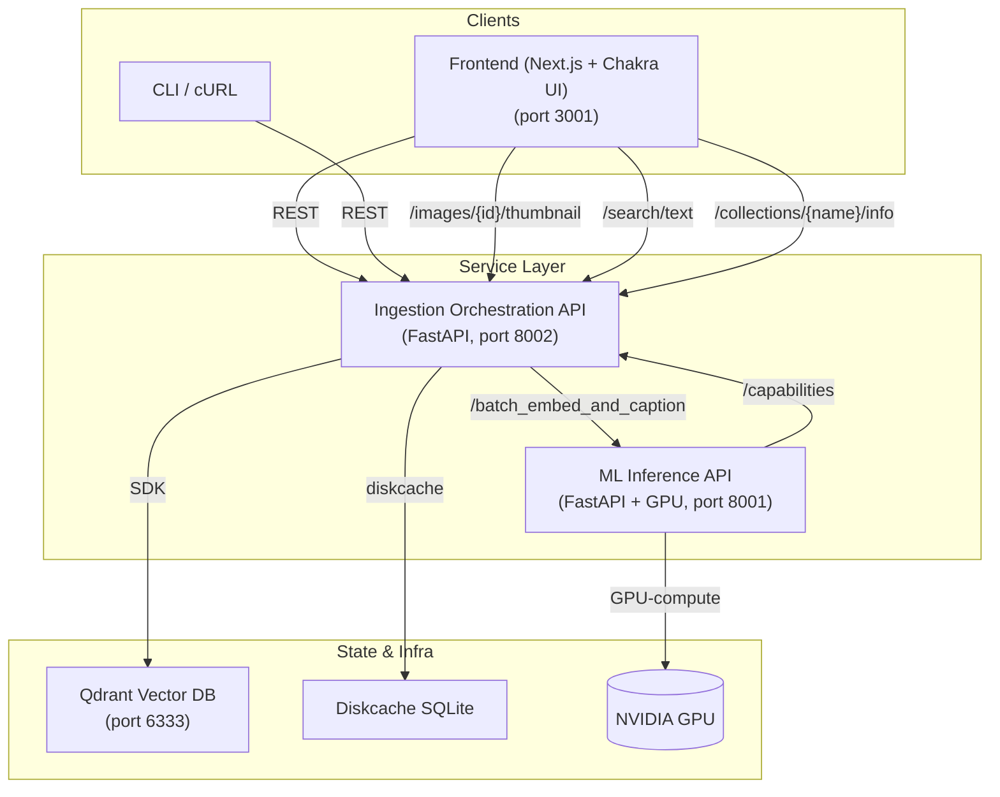

# Vibe Coding – Backend Architecture Specification (December 2024)

> **Scope**  This document describes the high-level architecture of the backend stack located in `/backend`. It is aimed at frontend engineers and new backend contributors who need a concise yet technically detailed overview of how the services fit together.

---

## 1  Service Overview

| Service | Location | Runtime | Responsibilities |
|---------|----------|---------|------------------|
| **Ingestion Orchestration API** | `backend/ingestion_orchestration_fastapi_app` | FastAPI (Python 3.11) | Traverses a local directory, computes hashes, generates thumbnails, batches images and calls the ML service; writes vectors & metadata to Qdrant; exposes CRUD/query endpoints for the image collection; serves thumbnails and image metadata. |
| **ML Inference API** | `backend/ml_inference_fastapi_app` | FastAPI + PyTorch 2 | Runs CLIP & BLIP models on GPU to generate image embeddings & captions; returns results for single images or batches; reports GPU capability info; supports text embedding for semantic search. |
| **Vector DB (Qdrant)** | External container / local native | Rust server | Stores high-dimensional image embeddings plus arbitrary JSON payload including base64 thumbnails; provides similarity search. |
| **Disk Cache** | `backend/.diskcache` (SQLite) | Python `diskcache` | Local on-disk cache used by ingestion service for deduplication and progress persistence. |

---

## 2  API Endpoints

### 2.1  Ingestion Orchestration API (`/api/v1`)

| Method | Path | Request Payload | Response Payload |
|--------|------|-----------------|------------------|
| `POST` | `/ingest/` | `{ directory_path: str }` | `{ job_id: str, status: str, message: str }` (202 response) |
| `GET` | `/ingest/status/{job_id}` | *–* | `{ job_id, status, progress, logs, result?, processed_files, total_files, errors }` |
| `GET` | `/collections` | *–* | `[ "collection_a", "collection_b", … ]` |
| `GET` | `/collections/{name}/info` | *–* | `{ name, status, points_count, vectors_count, config, sample_points, is_active }` |
| `POST` | `/collections` | `{ collection_name: str, vector_size?: int, distance?: str }` | `{ status: "success", collection: str }` |
| `DELETE` | `/collections/{collection}` | *–* | `{ message: "deleted", collection_name }` |
| `POST` | `/collections/select` | `{ collection_name: str }` | `{ selected_collection: str }` |
| `POST` | `/collections/cache/clear` | *–* | `{ message: "cache cleared" }` |
| `POST` | `/search/text` | `{ query: str, limit?: int, offset?: int }` | `{ results: [{ id, score, payload, filename, thumbnail_url }] }` |
| `GET` | `/images/` | query params `page, per_page, filters?, sort_by?, sort_order?` | `{ total, page, per_page, results, next_page_offset }` |
| `GET` | `/images/{id}/thumbnail` | *–* | JPEG image binary (200x200px) |
| `GET` | `/images/{id}/info` | *–* | `{ id, filename, full_path, caption, file_hash, width, height, format, mode, has_thumbnail, exif? }` |
| `GET` | `/random` | *–* | `{ id, payload }` |
| `POST` | `/duplicates` | *(optional JSON body for threshold/limit)* | `{ status: "acknowledged", message: str }` |
| `POST` | `/ingest/scan` | `{ directory_path: str }` | `{ job_id: str, status: str, message: str }` (202 response) |
| `POST` | `/ingest/upload` | `multipart/form-data (files[])` | `{ job_id: str, status: str, message: str }` (202 response) |
| `GET` | `/images/{id}/image` | *–* | Binary image file (JPEG/PNG; RAW formats auto-converted to JPEG) |
| `GET` | `/umap/projection` | query param `sample_size` | `{ points: [ { id, x, y, thumbnail_base64, filename } ], collection }` |

### 2.2  ML Inference API (`/api/v1`)

| Method | Path | Request Payload | Response Payload |
|--------|------|-----------------|------------------|
| `POST` | `/embed` | `{ image_base64: str, filename: str }` | `{ embedding: float[], embedding_shape: int[], filename, model_name, device_used }` |
| `POST` | `/embed_text` | `{ text: str, description?: str }` | `{ embedding: float[], embedding_shape: int[], text, model_name, device_used }` |
| `POST` | `/caption` | `{ image_base64: str, filename: str }` | `{ caption: str, filename, model_name, device_used }` |
| `POST` | `/batch_embed_and_caption` | `{ images: [ { unique_id, image_base64, filename } ] }` | `{ results: [ { unique_id, filename, embedding?, caption?, error?, model_name_clip, model_name_blip, device_used } ] }` |
| `GET` | `/capabilities` | *–* | `{ safe_clip_batch: int }` |

> *Planned*: `/batch_embed_and_caption_multipart` (multipart upload) once roadmap task *C-2* lands.

---

## 3  Database Design

### 3.1  Qdrant Collections (Vector DB)

| Field | Type | Notes |
|-------|------|-------|
| `id` | UUID (string) | Primary point identifier, generated per image. Deduplication hash stored separately (`file_hash`). |
| `vector` | `float[512]` | CLIP embedding (ViT-B/32 FP16). |
| `payload` | JSON | `{ filename, full_path, caption?, width, height, format, mode, file_hash, thumbnail_base64, exif_*, tags }`. |

**Key Payload Fields:**
- `thumbnail_base64`: Base64-encoded JPEG thumbnail (200x200px) for fast display
- `file_hash`: SHA-256 hash for deduplication
- `exif_*`: EXIF metadata fields (e.g., `exif_DateTime`, `exif_Make`)
- `tags`: Optional list of keyword tags extracted from IPTC/XMP metadata

*Initialization*: Upon first run the ingestion service checks for the configured collection and creates it via Qdrant HTTP API if missing (see `create_collection` endpoint). `vector_size` & `distance` parameters default to *512 / Cosine*.

### 3.2  Disk Cache (dedup/job progress)

`diskcache` automatically creates an SQLite DB (`backend/.diskcache/cache.db`). It stores key/value blobs:

```
CREATE TABLE Cache (
    key BLOB PRIMARY KEY,
    raw INTEGER,
    store_time REAL,
    expire_time REAL,
    access_time REAL,
    access_count INTEGER DEFAULT 0,
    tag BLOB,
    size INTEGER DEFAULT 0,
    mode INTEGER DEFAULT 0,
    filename TEXT,
    value BLOB
);
```

Keys include `sha256:<hash>` (dedup lookup with embedding and caption data) and `job:<id>:state` (progress snapshots).

### 3.3  ML Inference Service

No persistent database – model weights are loaded at runtime; transient tensors live in GPU memory only.

---

## 4  Inter-service Communication

1. **REST over HTTP** – The ingestion service calls the ML service via `httpx.AsyncClient` at `POST /api/v1/batch_embed_and_caption`.
2. **Batch Size Negotiation** – At startup the ingestion service queries `/api/v1/capabilities` to retrieve `safe_clip_batch` and clamps its own `ML_INFERENCE_BATCH_SIZE` env value.
3. **Vector Storage** – After receiving embeddings & captions, the ingestion service upserts data into **Qdrant** using its Python SDK (gRPC under the hood).
4. **Deduplication** – Ingestion computes SHA-256 hashes locally; cache hits/misses stored in Disk Cache with full ML results.
5. **Thumbnail Generation** – Ingestion service creates 200x200 JPEG thumbnails and stores them as base64 in Qdrant payload for fast frontend display.

Dependency graph:

```
Ingestion API  →  ML API  →  GPU
        ↘            ↘
          Qdrant      Disk Cache (local)
```

---

## 5  Frontend Integration

Endpoints that the UI calls directly:

* **/collections** (GET/POST/DELETE) – manage datasets.
* **/collections/{name}/info** – get collection statistics and sample data.
* **/collections/select** – set active collection.
* **/ingest/** – kick off a job.
* **/ingest/status/{job_id}** – poll progress with detailed logs.
* **/search/text** – semantic text search with thumbnail URLs.
* **/images/{id}/thumbnail** – fast thumbnail serving (cached JPEG).
* **/images/{id}/info** – detailed image metadata.
* **/images/** – paginated image listing with filtering.
* **/random** – random image discovery.

### Authentication / Authorization

Currently **none** (services assume trusted LAN). The roadmap lists an *API-Key* mechanism as **Priority 2**; once implemented clients must add header `x-api-key` to protected endpoints.

---

## 6  Architecture Diagram (Mermaid)



---

**Revision history**

| Date | Author | Notes |
|------|--------|-------|
| 2025-06-12 | Senior Backend Architect (AI) | Initial architecture spec covering both backend services and data stores. |
| 2024-12-19 | AI Assistant | Updated with thumbnail support, collection info endpoint, text search, enhanced job tracking, and corrected port numbers (8002 for ingestion). |
| 2025-06-17 | AI Assistant | Added new ingestion scan/upload, full-image, and UMAP endpoints; updated database point ID semantics and payload docs. | 