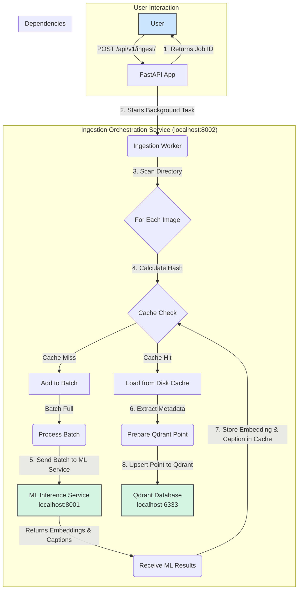

# Ingestion Orchestration FastAPI Service

This service provides a robust backend for orchestrating the ingestion of image directories. It handles metadata extraction, manages a persistent cache, and communicates with a Qdrant vector database and a separate ML Inference Service to generate embeddings and captions for images.

## Architecture

The service is designed around a decoupled, asynchronous workflow. When a user requests to ingest a directory, the service immediately returns a job ID and begins processing in the background.



### How It Works

1.  **Ingestion Request**: A user sends a `POST` request to `/api/v1/ingest/` with a directory path.
2.  **Background Job**: The service immediately returns a `job_id` and starts a background task to process the images, preventing the API from timing out.
3.  **Image Processing**: For each file in the directory:
    *   It calculates the SHA256 hash of the image content.
    *   It checks a local disk cache (`.diskcache`) to see if the image has been processed before.
4.  **Cache Handling**:
    *   **Cache Hit**: If the hash is found, it retrieves the pre-computed embedding and caption directly from the cache.
    *   **Cache Miss**: If the hash is not found, the image is added to a batch to be sent to the ML Inference service.
5.  **ML Inference**: Once the batch reaches a configured size, the orchestration service sends it to the ML Inference Service, which returns vector embeddings and generated text captions.
6.  **Database Storage**: The embedding, caption, and extracted metadata (from EXIF, etc.) are used to create a "point" in the Qdrant vector database. These points are then searchable.
7.  **Job Status**: The user can poll the `GET /api/v1/ingest/status/{job_id}` endpoint to get real-time updates on the ingestion progress.

## How to Run the Service

### Prerequisites

1.  **Docker**: To run the Qdrant database dependency.
2.  **Python 3.9+**: With `pip` for installing packages.
3.  **ML Inference Service**: The sibling service (`ml_inference_fastapi_app`) must be running, as this service depends on it.

### Step-by-Step Guide

1.  **Start Dependencies**: From the root of the `Vibe Coding` project, start the Qdrant database using Docker Compose.

    ```bash
    docker-compose up -d
    ```

2.  **Install Python Packages**: Install the required Python libraries from the `requirements.txt` file.

    ```bash
    pip install -r backend/ingestion_orchestration_fastapi_app/requirements.txt
    ```

3.  **Start the ML Inference Service**: In a separate terminal, start the ML service.

    ```bash
    uvicorn backend.ml_inference_fastapi_app.main:app --host 0.0.0.0 --port 8001
    ```

4.  **Start this Service**: In another terminal, start the ingestion orchestration service.

    ```bash
    uvicorn backend.ingestion_orchestration_fastapi_app.main:app --host 0.0.0.0 --port 8002 --reload
    ```
    *Note: The `--reload` flag is useful for development as it automatically restarts the server when code changes are detected.*

## API Endpoints

All endpoints are prefixed with `/api/v1`.

### Collection Management

You must create and select a collection before you can ingest any images.

**1. Create a Collection**
```bash
# Creates a new collection named "my_photo_collection"
curl -X POST -H "Content-Type: application/json" -d '{"collection_name": "my_photo_collection"}' http://localhost:8002/api/v1/collections
```

**2. List All Collections**
```bash
curl http://localhost:8002/api/v1/collections
```

**3. Delete a Collection**
```bash
# Deletes the collection named "my_photo_collection"
curl -X DELETE http://localhost:8002/api/v1/collections/my_photo_collection
```

**4. Select a Collection**
This tells the service which collection to use for all subsequent ingestion jobs.
```bash
# Selects "my_photo_collection" as the active collection
curl -X POST -H "Content-Type: application/json" -d '{"collection_name": "my_photo_collection"}' http://localhost:8002/api/v1/collections/select
```

### Image Ingestion

**1. Start an Ingestion Job**
*Make sure you have selected a collection first.*
```bash
# Starts ingesting images from the specified local directory
# NOTE: Provide the full, absolute path to the directory.
curl -X POST -H "Content-Type: application/json" -d '{"directory_path": "C:/Users/YourUser/Pictures/MyVacation"}' http://localhost:8002/api/v1/ingest/
```

**2. Get Ingestion Job Status**
Use the `job_id` returned from the previous command.
```bash
# Checks the status of a specific job
curl http://localhost:8002/api/v1/ingest/status/your-job-id-here
```

### Cache Management

**Clear the Cache for a Collection**
This will clear the disk cache for the currently *active* collection, forcing all images to be re-processed by the ML service upon next ingestion.
```bash
curl -X POST http://localhost:8002/api/v1/collections/cache/clear
```

## Environment Variables

The service can be configured using the following environment variables:

-   `ML_INFERENCE_SERVICE_URL`: URL of the ML Inference service. (Default: `http://localhost:8001`)
-   `QDRANT_HOST`: Hostname of the Qdrant database. (Default: `localhost`)
-   `QDRANT_PORT`: Port for the Qdrant database. (Default: `6333`)
-   `QDRANT_VECTOR_SIZE`: The dimension of the vectors to be stored. Must match the output of the ML model. (Default: `512`)
-   `QDRANT_DISTANCE_METRIC`: The distance metric used for vector comparison in Qdrant. (Default: `Cosine`)
-   `ML_INFERENCE_BATCH_SIZE`: Number of images to send to the ML service in a single batch. (Default: `8`)
-   `QDRANT_UPSERT_BATCH_SIZE`: Number of points to send to Qdrant in a single bulk upsert. (Default: `32`)

## Potential Next Steps

-   **Resolve Dependency Mismatch**: The `qdrant-client` version should be updated in `requirements.txt` to better align with the Qdrant server version used in `docker-compose.yml` to resolve the version mismatch warning on startup.
-   **Authentication**: Secure the API endpoints with a simple API key or a more robust OAuth2 implementation.
-   **Flexible Collection Creation**: Allow users to specify vector parameters (size, distance) in the `POST /collections` request body instead of relying on global environment variables.
-   **More Robust Error Handling**: Improve error reporting within ingestion jobs. If an image fails, provide more detailed reasons in the job status logs.
-   **Add a UI**: This service is a perfect backend for a web-based user interface that would allow users to manage collections and trigger ingestion jobs without using `curl`.