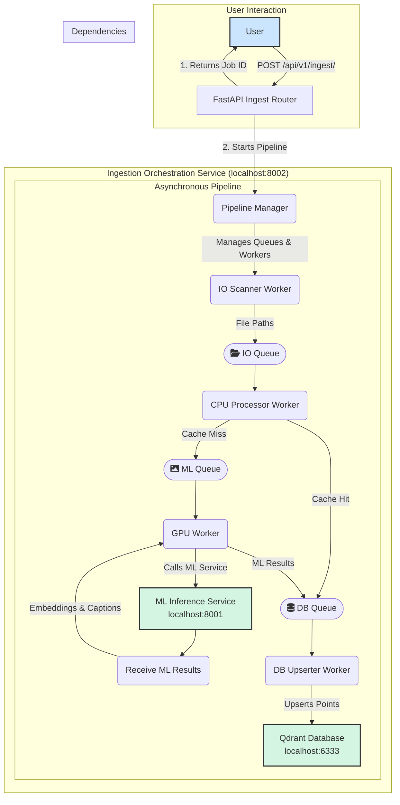

# Ingestion Orchestration FastAPI Service

This service provides a robust backend for orchestrating the ingestion of image directories. It is built on a modular, asynchronous pipeline architecture to efficiently handle file I/O, CPU-bound processing, and GPU-bound ML inference.

## Architecture

The service is designed around a decoupled, asynchronous pipeline managed by a central `PipelineManager`. When a user requests to ingest a directory, the service immediately returns a job ID and begins processing in the background using a series of queues and workers.

**New in June 2025:** The ingestion service now includes a periodic background task that fetches ML service capabilities every 10 seconds. This ensures that batch sizes and readiness are always up to date, even if the ML service is slow to start or restarts. The system will self-heal and become ready for ingestion as soon as the ML service is available, without requiring a restart.



### How It Works

1.  **Ingestion Request**: A user sends a `POST` request to an ingestion endpoint (e.g., `/api/v1/ingest/scan`).
2.  **Pipeline Initialization**: The router delegates the request to the `PipelineManager`, which immediately returns a `job_id`. The manager then sets up a series of `asyncio.Queue`s and starts the background worker tasks.
3.  **IO Scanner**: The `io_scanner.py` worker traverses the target directory, putting the file paths of potential images onto an I/O queue.
4.  **CPU Processor**: The `cpu_processor.py` worker consumes file paths from the I/O queue. For each file, it performs CPU-intensive tasks:
    *   Calculates the SHA256 hash of the image content.
    *   Checks a local disk cache (`.diskcache`) to see if the image has been processed before.
    *   **Cache Hit**: If found, the pre-computed data is sent directly to the database queue.
    *   **Cache Miss**: If not found, the image data is placed in the ML queue for processing.
5.  **GPU Worker**: The `gpu_worker.py` worker consumes from the ML queue. It groups images into batches and sends them to the separate **ML Inference Service** for embedding and captioning. The results are then placed in the database queue.
6.  **DB Upserter**: The `db_upserter.py` worker consumes from the database queue, batches the points, and performs an efficient bulk upsert into the Qdrant vector database.
7.  **Job Status & Completion**: The `PipelineManager` monitors the queues and worker tasks. It provides real-time progress updates via the `GET /api/v1/ingest/status/{job_id}` endpoint and gracefully shuts down the pipeline once all queues are empty and processed.

## How to Run the Service

### Prerequisites

1.  **Docker**: To run the Qdrant database dependency.
2.  **Python 3.9+**: With `pip` for installing packages.
3.  **ML Inference Service**: The sibling service (`ml_inference_fastapi_app`) must be running, as this service depends on it.

### Step-by-Step Guide

1.  **Start Dependencies**: From the root of the `Vibe Coding` project, start the Qdrant database using Docker Compose.

    ```bash
    docker-compose up -d
    ```

2.  **Install Python Packages**: Install the required Python libraries from the `requirements.txt` file.

    ```bash
    pip install -r backend/ingestion_orchestration_fastapi_app/requirements.txt
    ```

3.  **Start the ML Inference Service**: In a separate terminal, start the ML service.

    ```bash
    uvicorn backend.ml_inference_fastapi_app.main:app --host 0.0.0.0 --port 8001
    ```

4.  **Start this Service**: In another terminal, start the ingestion orchestration service.

    ```bash
    uvicorn backend.ingestion_orchestration_fastapi_app.main:app --host 0.0.0.0 --port 8002 --reload
    ```
    *Note: The `--reload` flag is useful for development as it automatically restarts the server when code changes are detected.*

## API Endpoints

All endpoints are prefixed with `/api/v1`.

### Collection Management

You must create and select a collection before you can ingest any images.

**1. Create a Collection**
```bash
# Creates a new collection named "my_photo_collection" with default vector parameters
curl -X POST -H "Content-Type: application/json" -d '{"collection_name": "my_photo_collection"}' http://localhost:8002/api/v1/collections

# Creates a new collection with specific vector parameters
curl -X POST -H "Content-Type: application/json" -d '{"collection_name": "my_other_photos", "vector_size": 768, "distance": "Euclid"}' http://localhost:8002/api/v1/collections
```

**2. List All Collections**
```bash
curl http://localhost:8002/api/v1/collections
```

**3. Delete a Collection**
```bash
# Deletes the collection named "my_photo_collection"
curl -X DELETE http://localhost:8002/api/v1/collections/my_photo_collection
```

**4. Select a Collection**
This tells the service which collection to use for all subsequent ingestion jobs.
```bash
# Selects "my_photo_collection" as the active collection
curl -X POST -H "Content-Type: application/json" -d '{"collection_name": "my_photo_collection"}' http://localhost:8002/api/v1/collections/select
```

### Image Ingestion

**1. Start an Ingestion Job**
*Make sure you have selected a collection first.* There are now two ways to ingest:

**A) Scan a server-side directory path:**
```bash
# Starts ingesting images from the specified local directory
# NOTE: Provide the full, absolute path to the directory.
curl -X POST -H "Content-Type: application/json" -d '{"directory_path": "C:/Users/YourUser/Pictures/MyVacation"}' http://localhost:8002/api/v1/ingest/scan
```

**B) Upload files directly:**
```bash
# Upload one or more image files
curl -X POST -F "files=@/path/to/image1.jpg" -F "files=@/path/to/image2.png" http://localhost:8002/api/v1/ingest/upload
```

**2. Get Ingestion Job Status**
Use the `job_id` returned from the previous commands.
```bash
# Checks the status of a specific job
curl http://localhost:8002/api/v1/ingest/status/your-job-id-here
```
The `result` field in the response will be populated when the job is `completed` or `failed`. For a successful job, it will contain a structured report:
```json
{
    "result": {
        "total_processed": 50,
        "total_failed": 2,
        "total_from_cache": 10,
        "processed_files": [
            {
                "file": "C:/Users/YourUser/Pictures/MyVacation/image1.jpg",
                "source": "batch_ml",
                "details": {
                    "caption": "a sandy beach with blue water",
                    "full_path": "..." 
                }
            }
        ],
        "failed_files": [
            {
                "file": "C:/Users/YourUser/Pictures/MyVacation/unsupported.gif",
                "error": "Skipped non-image file",
                "details": "File type not supported"
            }
        ]
    }
}
```

### Cache Management

**Clear the Cache for a Collection**
This will clear the disk cache for the currently *active* collection, forcing all images to be re-processed by the ML service upon next ingestion.
```bash
curl -X POST http://localhost:8002/api/v1/collections/cache/clear
```

## Environment Variables

The service can be configured using the following environment variables:

-   `ML_INFERENCE_SERVICE_URL`: URL of the ML Inference service. (Default: `http://localhost:8001`)
    -   **Note:** The ingestion service periodically fetches capabilities from this endpoint to dynamically update batch sizes and readiness.
-   `QDRANT_HOST`: Hostname of the Qdrant database. (Default: `localhost`)
-   `QDRANT_PORT`: Port for the Qdrant database. (Default: `6333`)
-   `QDRANT_VECTOR_SIZE`: The dimension of the vectors to be stored. Must match the output of the ML model. (Default: `512`)
-   `QDRANT_DISTANCE_METRIC`: The distance metric used for vector comparison in Qdrant. (Default: `Cosine`)
-   `ML_INFERENCE_BATCH_SIZE`: Number of images to send to the ML service in a single batch. **Default updated: `128`** (tune according to GPU memory).
-   `QDRANT_UPSERT_BATCH_SIZE`: Number of points to send to Qdrant in a single bulk upsert. (Default: `32`)

## Recent Benchmark Results (2025-06-12)

The first successful end-to-end run after fixing the RAW-filename bug processed **25 Sony `.dng` files in 110.78 s** with **0 failures**.

```
PS> python backend/scripts/ingest_benchmark.py --folder "C:\dng test" --collection "post-optim"
Selected collection 'post-optim'.
Ingestion job started: a5502559-d7c1-4b4d-a83b-b557ad5590c6
...
Progress: 100.0%
Ingestion completed in 110.78 seconds.
Result: {'total_processed': 25, 'total_failed': 0}
```

GPU-side logs show that each 8-image batch took ~11 s; batching is now the main optimisation target.

## Duplicate & Curation Endpoints

- `POST /api/v1/duplicates/find-similar` – run near-duplicate analysis in the background
- `GET /api/v1/duplicates/report/{task_id}` – retrieve progress and results
- `POST /api/v1/duplicates/archive-exact` – move exact duplicates to `_VibeDuplicates`
- `POST /api/v1/curation/archive-selection` – archive selected images with a collection snapshot

## Potential Next Steps (Roadmap as of 2025-06-12)

1.  **Increase ML batch size** – raise `ML_INFERENCE_BATCH_SIZE` default to `128` and/or fetch the safe value probed by the ML service at runtime.  This will cut GPU cycles by ~3× for small-to-medium ingest runs.
2.  **Remove redundant DNG→PNG conversion** – send RAW bytes directly to the ML service and let it decode.  Eliminates one full RAW decode per file.
3.  **Authentication** – *optional for local, offline usage.* When/if the services are exposed beyond localhost, protect `/batch_embed_and_caption` with an `x-api-key` header shared between services.
4.  **More Robust Error Handling** – include structured error codes in job status so the frontend can surface actionable messages.
5.  **Add a UI** – a lightweight admin dashboard (Streamlit or React) for collection management and job monitoring.
