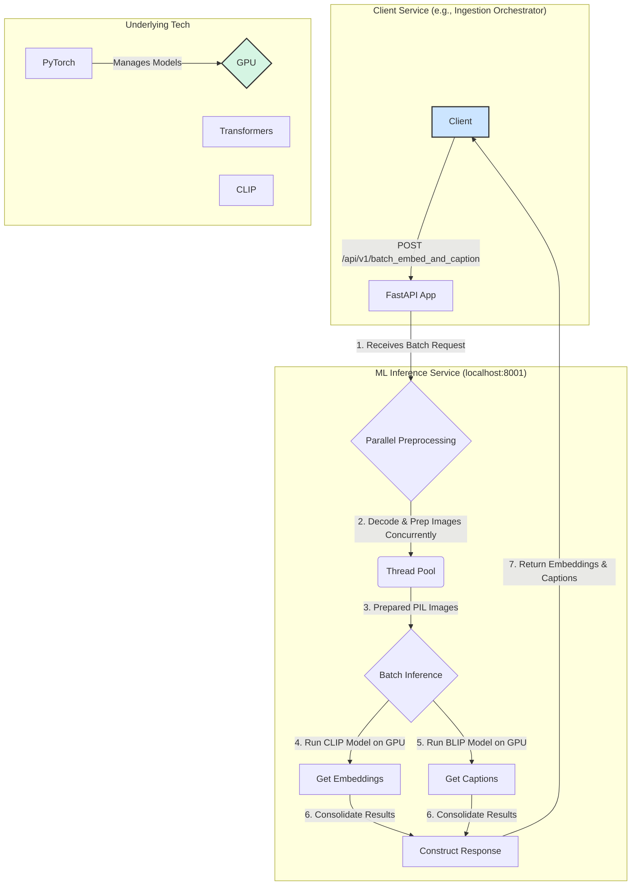

# ML Inference FastAPI Service

This service provides high-performance, GPU-accelerated machine learning model inference for image embedding and captioning. It is designed to be a backend dependency for other services that need to understand image content, such as the `ingestion_orchestration_fastapi_app`.

## Architecture

The service loads state-of-the-art ML models (OpenAI's CLIP and Salesforce's BLIP) into GPU memory at startup for low-latency responses. It exposes endpoints for processing single images or, for maximum efficiency, batches of images. All heavy I/O and CPU-bound preprocessing tasks are offloaded to a thread pool to keep the server responsive.

> **GPU Batch Capability Probe**  
> At startup the service measures available GPU memory and determines a *safe batch size*. On the test machine it reported **471 images** for ViT-B/32 at FP16 precision. Clients should cap their batch payloads at or below this value to avoid OOM errors.



### How It Works

1.  **Model Loading**: On startup, the service loads the specified CLIP and BLIP models onto the configured device (e.g., `cuda`).
2.  **API Request**: A client sends a batch of images (as base64-encoded strings) to the `/api/v1/batch_embed_and_caption` endpoint.
3.  **Parallel Preprocessing**: The service immediately offloads the decoding and preprocessing of all images in the batch to a concurrent thread pool. This prevents the server from blocking and is the key to its high throughput.
4.  **Batched Inference**: Once all images are prepared, they are collated into tensors and sent to the models on the GPU in a single pass.
    *   First, the CLIP model generates a vector embedding for each image.
    *   Second, the BLIP model generates a descriptive text caption for each image.
5.  **Response**: The embeddings and captions are packaged into a JSON response and sent back to the client.

## How to Run the Service

### Prerequisites

1.  **NVIDIA GPU & CUDA**: For GPU acceleration, an NVIDIA graphics card with the appropriate CUDA toolkit installed is required.
2.  **Python 3.9+**: With `pip` for installing packages.

### Step-by-Step Guide

1.  **Install Python Packages**: Install the required Python libraries from the `requirements.txt` file. It is highly recommended to do this in a virtual environment.

    ```bash
    pip install -r backend/ml_inference_fastapi_app/requirements.txt
    ```

2.  **Start the Service**: In a terminal, start the ML inference service using Uvicorn.

    ```bash
    # For development (with auto-reload)
    uvicorn backend.ml_inference_fastapi_app.main:app --host 0.0.0.0 --port 8001 --reload

    # For production
    uvicorn backend.ml_inference_fastapi_app.main:app --host 0.0.0.0 --port 8001
    ```

## API Endpoints

All endpoints are prefixed with `/api/v1`.

### Main Batch Endpoint

This is the primary and most efficient endpoint for the service.

**1. Get Embeddings and Captions for a Batch of Images**
```bash
# Example with two images. The base64 strings are truncated for brevity.
curl -X POST -H "Content-Type: application/json" -d '{
  "images": [
    {
      "unique_id": "image_001.jpg",
      "image_base64": "/9j/4AAQSkZJRgABAQAAAQABAAD...",
      "filename": "image_001.jpg"
    },
    {
      "unique_id": "photo_archive/image_002.png",
      "image_base64": "iVBORw0KGgoAAAANSUhEUgAAAAEAAAABCAQAAAC1HAwCAAAAC0lEQVR42mNkYAAAAAYAAjCB0C8AAAAASUVORK5CYII=",
      "filename": "image_002.png"
    }
  ]
}' http://localhost:8001/api/v1/batch_embed_and_caption
```

-   **Response**: The service will return a list of results, one for each image, containing the embedding and caption, or an error if processing for that specific image failed.

### Single Image Endpoints (for Debugging/Testing)

**2. Get Embedding for a Single Image**
```bash
curl -X POST -H "Content-Type: application/json" -d '{
  "image_base64": "/9j/4AAQSkZJRgABAQAAAQABAAD...",
  "filename": "image_001.jpg"
}' http://localhost:8001/api/v1/embed
```

**3. Get Caption for a Single Image**
```bash
curl -X POST -H "Content-Type: application/json" -d '{
  "image_base64": "/9j/4AAQSkZJRgABAQAAAQABAAD...",
  "filename": "image_001.jpg"
}' http://localhost:8001/api/v1/caption
```

## Environment Variables

The service can be configured using the following environment variables:

-   `CLIP_MODEL_NAME`: The name of the OpenAI CLIP model to use. (Default: `ViT-B/32`)
-   `BLIP_MODEL_NAME`: The name of the Salesforce BLIP model from Hugging Face. (Default: `Salesforce/blip-image-captioning-large`)
-   `DEVICE_PREFERENCE`: The device to run the models on. Can be `cuda` or `cpu`. (Default: `cuda`)
-   `LOG_LEVEL`: The logging level for the application. (Default: `INFO`)
-   `PORT`: The port on which the service will run. (Default: `8001`)

---

> **@sprint-08**: Starting both backend services was problematic due to import and environment issues. Always use `uvicorn main:app` and check your Python environment. See the sprint-08 notes for more context. 