# 🎨 Sprint 02: Visual Design System - Comprehensive Mindmap

```mermaid
mindmap
  root((Sprint 02: Visual Design System))
    
    🏗️ Foundation Ready
      ✅ Sprint 01 Complete
        Unified 3-Screen Architecture
          Screen 1: Fast UI (User-focused)
          Screen 2: Loading (Engaging)
          Screen 3: Advanced UI (Sophisticated)
        Component Integration
          components/search/ - Text search, AI games, duplicates
          components/visualization/ - UMAP, DBSCAN, interactive plots
          components/sidebar/ - Context-aware sidebar content
        Performance Baseline
          <1s startup maintained
          Thread-safe background loading
          95% memory reduction achieved
      📊 Current Visual State
        Basic Streamlit defaults
          Default CSS styling
          Standard Streamlit components
          No custom animations
          Basic color scheme
        Functional but not polished
          All features working
          Clean information hierarchy
          User-focused messaging
          Graceful error handling
      🎯 Architecture Stability
        Core systems solid
          app.py entry point clean
          core/ module organized
          screens/ architecture proven
          components/ extraction complete
        
    🎨 Week 1: Design Foundation
      🎨 Custom CSS System
        Design Variables
          Color Palette Definition
            Primary: #1f77b4 (Detective Blue)
            Secondary: #ff7f0e (Accent Orange)  
            Success: #2ca02c (Action Green)
            Warning: #d62728 (Alert Red)
            Background: #f8f9fa (Light Gray)
            Dark Mode: #2b2b2b (Charcoal)
          Typography System
            Headers: 'Inter', sans-serif
            Body: 'Source Sans Pro', sans-serif
            Code: 'JetBrains Mono', monospace
            Font sizes: 1rem, 1.2rem, 1.5rem, 2rem
          Spacing Standards
            Base unit: 0.5rem (8px)
            Margins: 1rem, 1.5rem, 2rem
            Padding: 0.5rem, 1rem, 1.5rem
            Component gaps: 1rem standard
        CSS Architecture
          styles/main.css - Core design system
          styles/components.css - Component-specific styles
          styles/themes.css - Light/dark theme support
          styles/responsive.css - Mobile optimization
        Implementation Strategy
          Streamlit st.markdown with unsafe_allow_html
          CSS variables for consistency
          Component-specific class naming
          Progressive enhancement approach
      
      🖼️ Screen-Specific Styling
        Screen 1: Fast UI Polish
          Welcome Section Design
            Hero banner with gradient background
            Typography hierarchy enhancement
            Icon integration for capabilities
            Improved spacing and layout
          Folder Selection Enhancement
            Custom input field styling
            Action button improvements
            Visual validation feedback
            Help section card design
          Sidebar Quick Actions
            Button styling consistency
            Hover state animations
            Status indicator design
            Progress communication
        Screen 2: Loading Experience  
          Progress Visualization
            Custom progress bar design
            Phase indicator styling
            Loading animation creation
            Time estimate formatting
          Excitement Building UI
            Feature preview cards
            Animated status updates
            Anticipation messaging design
            Background preparation indicators
        Screen 3: Advanced Features
          Component Integration Polish
            Tab system visual enhancement
            Search interface refinement
            Result display optimization
            Interaction feedback improvement
          Data Visualization Enhancement
            UMAP plot styling improvements
            Clustering visualization polish
            Interactive element design
            Performance metric displays
            
      ✨ Smooth Transitions
        Screen Navigation
          Fade Transitions
            Screen 1 → Screen 2: Smooth fade out/in
            Screen 2 → Screen 3: Loading completion animation
            Error states: Gentle error transitions
            Success states: Celebration animations
          State Preservation
            Maintain user context during transitions
            Preserve form data and selections
            Continue background processes seamlessly
            Handle state errors gracefully
        Loading States
          Skeleton Screens
            Component loading placeholders
            Progressive content reveal
            Smooth content replacement
            Loading state error handling
          Progress Animations
            Smooth progress bar updates
            Phase transition animations
            Completion celebrations
            Time estimate updates
            
    🎭 Week 2: Interactions & Polish
      🔄 Micro-Interactions
        Interactive Elements
          Button Hover States
            Color transitions on hover
            Shadow depth changes
            Scale transformations (1.05x)
            Icon animations on interaction
          Form Feedback
            Real-time validation styling
            Input field focus states
            Error message animations
            Success confirmation design
          Search Enhancements
            Search suggestion styling
            Result highlight animations
            Filter interaction feedback
            Sorting animation effects
        Loading & Progress
          Component Loading
            Skeleton screen implementations
            Progressive content loading
            Smooth placeholder transitions
            Error state handling
          Search Results
            Staggered result animations
            Hover preview effects
            Selection state management
            Batch operation feedback
        Error Handling Design
          User-Friendly Messages
            Clear error communication
            Recovery action suggestions
            Visual error hierarchy
            Contextual help integration
          Recovery Flows
            Retry button styling
            Reset option design
            Fallback state presentation
            Emergency recovery interface
            
      📱 Mobile & Accessibility
        Responsive Design
          Breakpoint Strategy
            Desktop: 1200px+ (current focus)
            Tablet: 768px-1199px
            Mobile: <768px
            Touch optimization
          Layout Adaptations
            Collapsible sidebar on mobile
            Stack columns on small screens
            Touch-friendly button sizes (44px min)
            Simplified navigation patterns
          Performance Optimization
            CSS minification
            Asset optimization
            Progressive loading
            Responsive image handling
        Accessibility Improvements
          ARIA Implementation
            Screen reader support
            Semantic HTML structure
            Focus management
            Keyboard navigation
          Contrast & Readability
            WCAG 2.1 AA compliance
            Color contrast ratios 4.5:1+
            Font size minimums
            Clear visual hierarchy
          Keyboard Navigation
            Tab order optimization
            Focus indicators
            Skip links implementation
            Keyboard shortcuts
            
    🚀 Implementation Strategy
      🔄 Phase 1: Foundation (Week 1)
        Day 1-2: CSS System Setup
          Create styles/ directory structure
          Define design variables and tokens
          Implement core CSS architecture
          Test cross-browser compatibility
        Day 3-4: Screen 1 Enhancement
          Apply design system to Fast UI
          Implement hero section styling
          Enhance folder selection interface
          Add micro-interactions
        Day 5-7: Screen 2 Polish
          Style loading screen components
          Create progress animations
          Implement phase transitions
          Add excitement-building elements
          
      🎯 Phase 2: Advanced Features (Week 2)
        Day 8-10: Screen 3 Integration
          Apply design system to Advanced UI
          Style search and visualization components
          Implement result display enhancements
          Add interactive feedback
        Day 11-12: Transitions & Animations
          Implement screen transition effects
          Add loading state animations
          Create micro-interaction library
          Optimize animation performance
        Day 13-14: Polish & Testing
          Mobile responsiveness testing
          Accessibility audit and fixes
          Performance optimization
          Cross-browser testing
          
    📊 Success Metrics
      🎯 User Experience
        Visual Appeal
          Professional, modern appearance
          Consistent design language
          Engaging visual hierarchy
          Smooth, polished interactions
        Usability Improvements
          Reduced cognitive load
          Clear action affordances
          Intuitive navigation flow
          Helpful feedback systems
        Performance Maintenance
          No regression in load times
          Smooth animations (60fps)
          Responsive interactions (<100ms)
          Efficient CSS delivery
          
      📈 Technical Quality
        Code Organization
          Maintainable CSS architecture
          Reusable component styles
          Clear naming conventions
          Documented design system
        Accessibility Compliance
          WCAG 2.1 AA standards met
          Screen reader compatibility
          Keyboard navigation support
          Color contrast compliance
        Browser Support
          Chrome, Firefox, Safari, Edge
          Mobile browser optimization
          Graceful degradation
          Progressive enhancement
          
    🕰️ Timeline & Milestones
      Week 1 Deliverables
        ✅ CSS system architecture
        ✅ Screen 1 visual enhancement
        ✅ Screen 2 loading experience
        ✅ Basic animation library
      Week 2 Deliverables
        🎯 Screen 3 advanced styling
        🎯 Transition system complete
        🎯 Mobile responsiveness
        🎯 Accessibility compliance
      Final Sprint Goals
        🎆 Professional visual identity
        🎆 Smooth user experience
        🎆 Performance maintained
        🎆 Accessibility standards met
```



## 📝 Implementation Notes

### Design System Architecture

The visual design system will be built using a modular CSS architecture:

```
styles/
├── main.css           # Core design system
├── components.css     # Component-specific styles
├── themes.css         # Light/dark theme support
├── responsive.css     # Mobile optimization
└── animations.css     # Animation library
```

### Color Palette

```css
:root {
  --pd-primary: #1f77b4;      /* Detective Blue */
  --pd-secondary: #ff7f0e;    /* Accent Orange */
  --pd-success: #2ca02c;      /* Action Green */
  --pd-warning: #d62728;      /* Alert Red */
  --pd-background: #f8f9fa;   /* Light Gray */
  --pd-dark: #2b2b2b;         /* Charcoal */
}
```

### Typography Scale

```css
:root {
  --pd-font-family-heading: 'Inter', sans-serif;
  --pd-font-family-body: 'Source Sans Pro', sans-serif;
  --pd-font-family-mono: 'JetBrains Mono', monospace;
  
  --pd-font-size-sm: 0.875rem;
  --pd-font-size-base: 1rem;
  --pd-font-size-lg: 1.2rem;
  --pd-font-size-xl: 1.5rem;
  --pd-font-size-2xl: 2rem;
}
```

### Spacing System

```css
:root {
  --pd-space-xs: 0.25rem;     /* 4px */
  --pd-space-sm: 0.5rem;      /* 8px */
  --pd-space-md: 1rem;        /* 16px */
  --pd-space-lg: 1.5rem;      /* 24px */
  --pd-space-xl: 2rem;        /* 32px */
  --pd-space-2xl: 3rem;       /* 48px */
}
```

## 🎯 Sprint 02 Success Criteria

1. **Visual Consistency**: All screens follow the same design language
2. **Professional Appearance**: Modern, polished interface that builds user confidence
3. **Smooth Interactions**: 60fps animations and responsive feedback
4. **Accessibility**: WCAG 2.1 AA compliance for inclusive design
5. **Performance**: No regression in loading times or responsiveness
6. **Mobile Ready**: Responsive design that works on all device sizes

## 🔄 Integration with Existing Architecture

The design system will integrate seamlessly with the existing 3-screen architecture:

- **Screen 1 (Fast UI)**: Enhanced folder selection and welcome experience
- **Screen 2 (Loading)**: Engaging progress visualization and anticipation building
- **Screen 3 (Advanced UI)**: Sophisticated styling for search, visualization, and AI features

All enhancements will maintain the current performance characteristics and user flow while significantly improving the visual appeal and user experience.