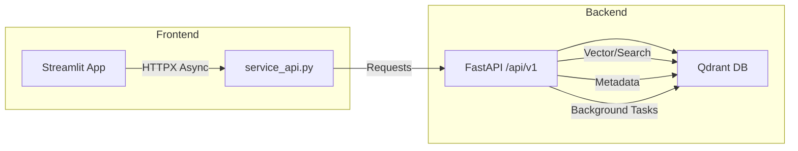

# Sprint 08 Technical Implementation Plan

## 1. Architecture Overview

- **Backend**: FastAPI application with routers under `/api/v1`: `search`, `images`, `duplicates`, `random`. Uses `qdrant-client` for vector operations.
- **Frontend**: Streamlit app with `service_api.py` providing async methods using `httpx.AsyncClient` (cached via `@st.cache_resource`). UI modules use `st.spinner`, `st.progress`, and skeleton placeholders via `st.empty()`.
- **Background Processing**: Duplicate detection runs in a `ThreadPoolExecutor` to avoid blocking the main event loop. Results are streamed back to UI.

## 2. Setup & Dependencies
- Add to `backend/ingestion_orchestration_fastapi_app/requirements.txt`: `qdrant-client>=0.8.1`, `fastapi`, `uvicorn`, `python-multipart`, `brotli`.
- Add to `frontend/requirements.txt`: `httpx`, `streamlit>=1.18.0`.
- Update `docker-compose.yml` to include a Qdrant service with `image: qdrant/qdrant:v1.3.0`.

## 3. Implementation Steps

### 3.1 Backend Service Enhancements (Initial coding DONE, testing pending)
1. **Search Router**: Create `backend/ingestion_orchestration_fastapi_app/routers/search.py`:
   - Implement `POST /api/v1/search` accepting embedding and filter payload.
   - Use `qdrant-client` `search()` method with vector and filter parameters.
   - Return results with pagination metadata (`total`, `page`, `per_page`).

2. **Images Router**: Create `backend/ingestion_orchestration_fastapi_app/routers/images.py`:
   - Implement `GET /api/v1/images` with query params `page`, `per_page`, filters, sort.
   - Use Qdrant's `scroll()` or similar for pagination.
   - Return images list and metadata.

3. **Duplicates Router**: Create `backend/ingestion_orchestration_fastapi_app/routers/duplicates.py`:
   - Define `POST /api/v1/duplicates` that triggers a vector-similarity search for duplicates.
   - Offload heavy computation to `ThreadPoolExecutor` (e.g., `executor.submit(detect_duplicates)`).
   - Return grouped results as they complete via streaming or final result.

4. **Random Router**: Create `backend/ingestion_orchestration_fastapi_app/routers/random.py`:
   - Implement `GET /api/v1/random` selecting a random point ID from Qdrant.
   - Use Qdrant's metadata or a random sampling strategy.

5. **Error Handling**: In `main.py`, add exception handlers for `RequestValidationError` and generic server errors, returning consistent JSON error schema.

6. **OpenAPI Docs**: Ensure all routers are registered; verify interactive docs at `/docs`.

### 3.2 Frontend App Updates (Initial coding for service_api.py DONE, UI pending)
1. **Service API**: In `frontend/core/service_api.py`:
   - Add `async def search_images_vector(...)`, `async def list_images_qdrant(...)` methods.
   - Add `async def get_duplicates_qdrant(self):` using background thread invocation.
   - Add `async def get_random_image_qdrant(self):` method.
   - Cache the `httpx.AsyncClient` with `@st.cache_resource`.

2. **UI Screens**: In `frontend/app.py` or `components/`:
   - **SearchScreen**: Add sidebar controls for filters (tags, date) and sort options; show progress with `st.progress`.
   - **DuplicateDetection**: New tab using `st.spinner` and placeholder containers for groups.
   - **RandomImage**: Button to fetch random image; display in `st.empty` placeholder.

3. **Performance & Feedback**:
   - Use `st.empty()` to reserve layout slots, then update with `st.image`, `st.table` as data loads.
   - For duplicate detection, show incremental progress: `progress = st.progress(0)` and update within thread callback.

4. **Accessibility & Responsiveness**:
   - Add ARIA labels via `st.markdown('
')` where needed.
   - Ensure keyboard navigation compatibility.

**[DONE] Duplicate Detection UI:**
- Implemented the Duplicate Detection tab in the Advanced UI (see `frontend/screens/advanced_ui_screen.py`).
- Added a trigger button to start duplicate detection, which calls the backend via `service_api.get_duplicates_qdrant()`.
- Shows a spinner/progress indicator while waiting for results.
- Displays grouped duplicate results with image previews, or an error/info message as appropriate.
- Handles UI state for loading, results, and errors using `st.session_state`.

### 3.3 Testing & CI
1. **Unit Tests**: Write pytest tests in `tests/`:
   - `test_search.py`, `test_images.py`, `test_duplicates.py`, `test_random.py`.
2. **Integration Tests**: Use Docker Compose fixture to spin up FastAPI + Qdrant; tests in `tests/integration/`.
3. **E2E Tests**: Add Playwright config and test scenarios for critical flows.
4. **Performance Tests**: Implement benchmarks using `pytest-benchmark`; integrate `nsys` profiling for GPU traces if needed.
5. **CI Pipeline**: Update GitHub Actions workflow:
   - Add services: Qdrant, Docker Compose up.
   - Run unit, integration, E2E, and benchmark tests.

## 4. Documentation & Handoff
- **Architecture Diagrams**: Update `/docs/architecture.md` with Mermaid diagrams showing new routers and data flow.
- **Service API Guide**: Generate markdown in `/docs/api/service_api.md` from docstrings.
- **Developer Guide**: Create `/docs/developers/feature_extension.md` explaining how to extend search and filtering.
- **Changelog**: Append Sprint 08 section to `CHANGELOG.md` summarizing features, fixes, and cleanup. 