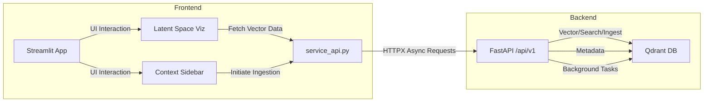

# Sprint 08 Technical Implementation Plan

## 1. Architecture Overview

- **Backend**: FastAPI application with routers under `/api/v1`: `search`, `images`, `duplicates`, `random`, **and a new `vectors/all-for-visualization` endpoint.** Uses `qdrant-client` for vector operations.
- **Frontend**: Streamlit app with `service_api.py` providing async methods using `httpx.AsyncClient` (cached via `@st.cache_resource`). **All backend interactions from UI components (e.g., `context_sidebar.py` for ingestion, `latent_space.py` for visualization data) are routed through `service_api.py`.** UI modules use `st.spinner`, `st.progress`, and skeleton placeholders via `st.empty()`.
- **Background Processing**: Duplicate detection runs in a `ThreadPoolExecutor` to avoid blocking the main event loop. **Folder ingestion initiated from `context_sidebar.py` triggers background tasks that call the Ingestion Orchestration service.** Results are streamed back to UI or status updated.

## 2. Setup & Dependencies
- Add to `backend/ingestion_orchestration_fastapi_app/requirements.txt`: `qdrant-client>=0.8.1`, `fastapi`, `uvicorn`, `python-multipart`, `brotli`.
- Add to `frontend/requirements.txt`: `httpx`, `streamlit>=1.18.0`.
- Update `docker-compose.yml` to include a Qdrant service with `image: qdrant/qdrant:v1.3.0`.

## 3. Implementation Steps

### 3.1 Backend Service Enhancements (Initial coding DONE, testing pending)
1. **Search Router**: Create `backend/ingestion_orchestration_fastapi_app/routers/search.py`:
   - Implement `POST /api/v1/search` accepting embedding and filter payload.
   - Use `qdrant-client` `search()` method with vector and filter parameters.
   - Return results with pagination metadata (`total`, `page`, `per_page`).

2. **Images Router**: Create `backend/ingestion_orchestration_fastapi_app/routers/images.py`:
   - Implement `GET /api/v1/images` with query params `page`, `per_page`, filters, sort.
   - Use Qdrant's `scroll()` or similar for pagination.
   - Return images list and metadata.

3. **Duplicates Router**: Create `backend/ingestion_orchestration_fastapi_app/routers/duplicates.py`:
   - Define `POST /api/v1/duplicates` that triggers a vector-similarity search for duplicates.
   - Offload heavy computation to `ThreadPoolExecutor` (e.g., `executor.submit(detect_duplicates)`).
   - Return grouped results as they complete via streaming or final result.

4. **Random Router**: Create `backend/ingestion_orchestration_fastapi_app/routers/random.py`:
   - Implement `GET /api/v1/random` selecting a random point ID from Qdrant.
   - Use Qdrant's metadata or a random sampling strategy.

5. **Error Handling**: In `main.py`, add exception handlers for `RequestValidationError` and generic server errors, returning consistent JSON error schema.

6. **OpenAPI Docs**: Ensure all routers are registered; verify interactive docs at `/docs`.

7. **Latent Space Data Endpoint (New)**:
   - Implement `GET /api/v1/vectors/all-for-visualization` in the Ingestion Orchestration service.
   - This endpoint should query Qdrant to retrieve all (or a representative sample of) vectors along with their `id`, `path`, and `caption` (from payload).
   - Structure the response as a JSON object, e.g., `{"data": [{"id": "...", "vector": [...], "payload": {"path": "...", "caption": "..."}}, ...]}`.

### 3.2 Frontend App Updates (Initial coding for service_api.py DONE, UI pending)
1. **Service API**: In `frontend/core/service_api.py`:
   - Add `async def search_images_vector(...)`, `async def list_images_qdrant(...)` methods.
   - Add `async def get_duplicates_qdrant(self):` using background thread invocation.
   - Add `async def get_random_image_qdrant(self):` method.
   - **Add `async def get_all_vectors_for_latent_space():` to fetch data for visualization.**
   - Cache the `httpx.AsyncClient` with `@st.cache_resource`.

2. **UI Screens**: In `frontend/app.py` or `components/`:
   - **SearchScreen**: Add sidebar controls for filters (tags, date) and sort options; show progress with `st.progress`.
   - **DuplicateDetection**: New tab using `st.spinner` and placeholder containers for groups.
   - **RandomImage**: Button to fetch random image; display in `st.empty` placeholder.
   - **`context_sidebar.py` (Refactor)**:
     - Modified to use `service_api.ingest_directory` for all folder processing and merging.
     - Removed direct `httpx` calls and local DB/model management logic.
     - UI feedback (spinners, status messages) updated to reflect API call initiation and background task status.
   - **`latent_space.py` (Refactor)**:
     - Visualization data (vectors, metadata) is now fetched via `service_api.get_all_vectors_for_latent_space()`.
     - UMAP/DBSCAN computations remain on the frontend but use data retrieved from the backend.
     - UI includes loading states and error handling for the data fetching process.

3. **Performance & Feedback**:
   - Use `