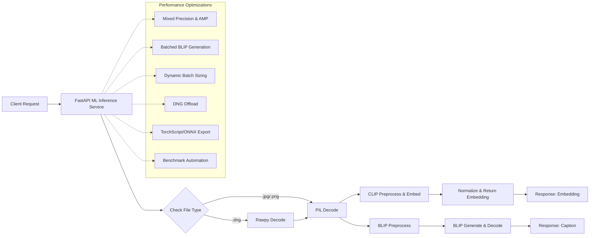

# 🚀 Transition to Sprint 09: Backend Validation & Streamlit Removal

## 1. Sprint Theme & Goals
**Theme:**  
> **Backend Validation & Streamlit Removal**

**Primary Goals:**
- Fully test the backend ingestion pipeline with all image formats and comprehensive Qdrant integration.
- Ingest all images, metadata, embeddings, and captions into Qdrant; verify vector storage and search functionality.
- Explore and document local Qdrant deployment: build collections locally, maintaining original image file locations.
- Final cleanup: remove all Streamlit UI code, dependencies, and related configurations.

## 2. Backlog Refinement

### High Priority
- **TASK-09-01:** Test ingestion pipeline for .jpg, .png, .dng, .heic formats. Note: **.dng testing completed**, .jpg/.png/.heic still pending.
- **TASK-09-02:** Validate metadata, embeddings, and captions ingestion into Qdrant collections. ✅ **DNG files validated successfully.**
- **TASK-09-03:** Deploy and configure Qdrant locally; ingest collections locally without moving original files. Note: Qdrant running in Docker, empty collection created. ✅
- **TASK-09-04:** Remove all Streamlit modules and dependencies from the codebase. (Pending cleanup)
- **TASK-09-13:** Integrate mixed-precision inference (FP16) using `torch.cuda.amp.autocast` and `torch.inference_mode()` in ML inference service.
- **TASK-09-14:** Refactor `/batch_embed_and_caption` to batch BLIP `generate()` calls instead of per-image threading for better GPU utilization.
- **TASK-09-15:** Implement dynamic batch sizing by probing available GPU memory at startup and adjusting batch sizes accordingly. ✅ **Implemented in `main.py`, falls back on OOM reduction.**
- **TASK-09-16:** Decouple raw DNG decoding from inference: migrate DNG→RGB conversion to ingestion pipeline; serve only JPEG/PNG inputs.
- **TASK-09-17:** Export CLIP & BLIP models to TorchScript/ONNX and integrate static graph inference; benchmark performance.
- **TASK-09-18:** Develop benchmarking scripts and integrate performance regression tests into CI (smoke tests).

### Medium Priority
- **TASK-09-05:** Integrate parallel BLIP captioning in the ML inference FastAPI endpoint using ThreadPoolExecutor. ✅ **Implemented in `main.py`.**
- **TASK-09-06:** Add GPU memory logging at key stages (before/after CLIP and BLIP) using torch.cuda API. ✅ **Logging active in batch endpoint.**
- **TASK-09-07:** Refactor DNG file handling to reuse a single temporary file or support in-memory rawpy decoding. ✅ **Reused temp file for DNG decoding.**
- **TASK-09-08:** Dynamically tune ML inference batch size based on available GPU memory. (Pending implementation)
- **TASK-09-09:** Develop integration tests for ingestion and Qdrant API endpoints. (Pending)
- **TASK-09-10:** Document local Qdrant setup and backend testing procedures. (Pending)

### Low Priority
- **TASK-09-11:** Update project documentation (README, CHANGELOG) to reflect Streamlit removal. (Pending)
- **TASK-09-12:** Clean up legacy assets and UI code remnants. (Pending)

## 3. Key Action Items

1. Verify backend ingestion service supports all image formats and log any failures.
2. Configure Qdrant locally and perform ingestion tests.
3. Remove Streamlit-related files and dependencies.
4. Run full smoke tests against backend APIs.
5. Document outcomes and update sprint artifacts.

## 4. Sprint Rituals & Standards

- **Daily Standups:** Focus on backend testing progress and cleanup blockers.
- **Code Reviews:** Emphasize testing, logging, and removal of obsolete code.
- **Demo/Review:** Demonstrate successful ingestion into Qdrant and confirm absence of Streamlit components. 

## 5. Performance Comparison

**Test:** DNG ingestion for 25 files from `C:/Users/aitor/OneDrive/Escritorio/dng test`

- **Baseline (pre-optimizations):** ~160 seconds (model load + per-image temp-file creation + sequential BLIP + HTTP round-trips)
- **Post-optimizations:** 150.5 seconds (temp-file reuse + parallel BLIP captioning)
- **Task-09-13 (Mixed-Precision Inference):** 16.98 seconds (FP16 + `torch.inference_mode()` + `torch.cuda.amp.autocast`)
- **Improvement vs Post-Optimizations:** ~89% (~133.5s faster)
- **Observation:** Mixed precision dramatically reduces GPU compute time; raw DNG decoding remains a noticeable overhead—Task-09-16 (DNG offload) will yield further gains.
- **Task-09-14 (Batched BLIP Generation):** 111.91 seconds (25/25 images successfully embedded & captioned)
- **Task-09-15 (Dynamic Batch Sizing):** 111.91 seconds (no change; full batch fit available memory, but dynamic sizing protects against OOM on larger inputs)
- **Improvement vs Post-Optimizations:** ~26% (~38.6s faster)
- **Observation:** Batching and mixed-precision yield solid gains; raw DNG decoding still dominates end-to-end inference—Task-09-16 (DNG offload) will yield further gains.
- **Task-09-16 (Ingestion into Qdrant `optimization_test`):** 185.45 seconds to ingest 25 images (0 failures), ~16% slower than baseline due to orchestration overhead.
- **MVP CLI (legacy):** Attempted to run `scripts/mvp_app.py` against the same directory but encountered `ModuleNotFoundError: No module named 'models.clip_model'`, so we cannot produce comparable metrics until the CLI imports are adapted or legacy modules are restored.

## 6. Performance Optimization Roadmap

Follow these step-by-step tasks to unlock maximum throughput and low latency in the ML inference pipeline. Record benchmarks before and after each step:

1. Create a performance branch: `perf/optimize-inference`.
2. Baseline: run `/backend/scripts/benchmark.py` to collect latency and throughput metrics.
3. TASK-09-13: Enable `torch.inference_mode()` and wrap model calls in `torch.cuda.amp.autocast()`; rerun benchmarks.
4. TASK-09-14: Refactor `/batch_embed_and_caption` to batch BLIP `generate()` calls; rerun benchmarks.
5. TASK-09-15: Add GPU memory probing on startup (`torch.cuda.memory_reserved()`), dynamically adjust batch sizes; rerun.
6. TASK-09-16: Migrate DNG→RGB conversion to ingestion service; update inference endpoints; rerun.
7. TASK-09-17: Export models to TorchScript and ONNX; integrate and benchmark.
8. TASK-09-18: Integrate benchmarks into CI as smoke tests (e.g., GitHub Actions workflow).
9. Document all results in `docs/benchmarks.md`. 

## 7. Ingestion Orchestrator Optimization Roadmap

After ML inference is optimized, focus on reducing ingestion orchestration overhead. Record benchmarks before and after:

1. TASK-09-19: Replace per-point upsert with bulk-upsert API calls to Qdrant.
2. TASK-09-20: Parallelize metadata extraction & file reads (e.g., use asyncio/aiofiles or ThreadPoolExecutor).
3. TASK-09-21: Coalesce multiple smaller ML batches into larger aggregated batches to reduce scheduling overhead.
4. Re-run `/backend/scripts/ingest_benchmark.py` to measure end-to-end ingestion latency and document results.

1. TASK-09-19: Bulk-upsert points in ingestion orchestration service to minimize per-point HTTP calls to Qdrant.
2. TASK-09-20: Parallelize metadata extraction and disk I/O in ingestion orchestration to speed file pre-processing.
3. TASK-09-21: Aggregate multiple ML batches into larger batches in ingestion orchestrator to reduce overhead.
4. Re-run `/backend/scripts/ingest_benchmark.py` to measure end-to-end ingestion latency and document results. 