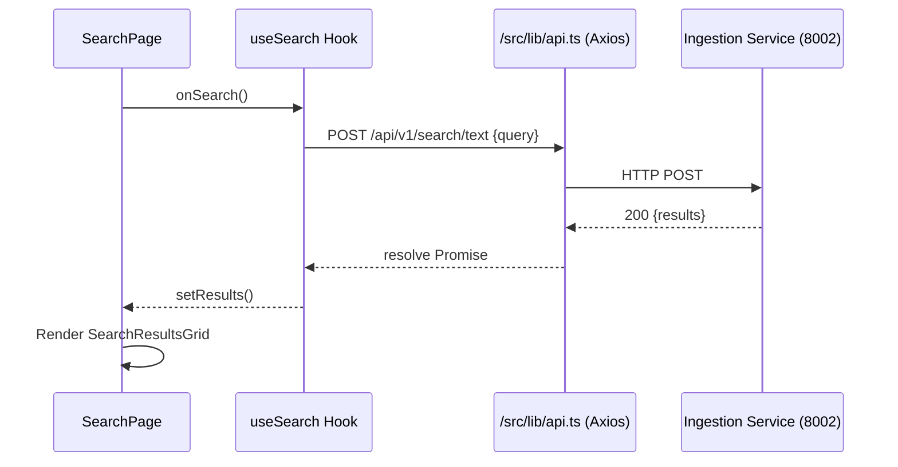

#Pixel Detective – Frontend Architecture Specification (June 2025)

> **Scope** This document gives a concise yet technically detailed overview of the React / Next.js code located in `/frontend`.  It is intended for new frontend contributors who need to understand how the application is structured and how it interacts with the backend services.

---

## 1 Tech-Stack Overview

| Layer | Library / Tool | Notes |
|-------|----------------|-------|
| Framework | **Next.js 15** (`app/` router) | SSR / ISR, React 18 concurrent features |
| UI Kit | **Chakra UI 2** | Component primitives, colour-mode, theme tokens |
| Data-Fetching | **@tanstack/react-query 5** | Queries, mutations, cache, background polling |
| Global State | **Zustand 5** | Lightweight store (currently active collection) |
| HTTP Client | **Axios 1** | Wrapped in `/src/lib/api.ts` |
| Icons | **react-icons** | Feather icon subset |
| Animations | **framer-motion** | Micro-interactions |
| Testing (planned) | Jest / RTL, Playwright | Not yet integrated |

---

## 2 Directory Structure

```
frontend/
  ├─ src/
  │   ├─ app/          # Next.js route segments
  │   │   ├─ layout.tsx  # Root layout & Chakra provider
  │   │   ├─ globals.css # CSS variables for SSR safety
  │   │   ├─ page.tsx    # Home dashboard (CSR only)
  │   │   ├─ collections/
  │   │   │   └─ page.tsx
  │   │   ├─ search/
  │   │   │   └─ page.tsx
  │   │   └─ logs/[jobId]/page.tsx
  │   ├─ components/
  │   │   ├─ … single-responsibility UI pieces
  │   │   └─ ui/   # design-system helpers (provider, colour-mode button)
  │   ├─ hooks/    # custom hooks (e.g. useSearch)
  │   ├─ lib/      # shared utilities (api.ts, polyfills.ts)
  │   └─ store/    # Zustand slices
  ├─ public/       # static assets (none yet)
  ├─ next.config.mjs  # Runtime rewrites + image domains
  └─ eslint.config.mjs / tsconfig.json
```

### 2.1 Page Responsibilities

| Route | File | Purpose |
|-------|------|---------|
| `/` | `app/page.tsx` | System status, quick actions, collection stats |
| `/collections` | `app/collections/page.tsx` | CRUD & selection of collections |
| `/search` | `app/search/page.tsx` | Text / image search UI, results grid |
| `/logs/[jobId]` | `app/logs/[jobId]/page.tsx` | Real-time ingestion job tracking |

### 2.2 Component Patterns

* **Container / Presentational split** – logic resides in hooks; components are mostly declarative UI.
* **Hydration-Safe** – every CSR file starts with `'use client'`; heavy browser APIs use `<ClientOnly>`.
* **Semantic Tokens** – colour names like `pageBg`, `textPrimary` defined in custom Chakra theme.

---

## 3 State Management Strategy

```
┌────────────┐      React Query      ┌───────────────┐
│  Backend   │  ←──────────────────→│  Query Cache  │
└────────────┘                      └───────────────┘
                                         │
                                         ▼
                                   Page / Component
                                         │
                                         ▼
                                   Zustand Store
```

* **Server state** (collections, search results, job status) lives in React Query for caching & polling.
* **UI state** (selected collection) is kept in a minimal Zustand store to avoid prop-drilling.

---

## 4 Data Flow Example – _Image Search_



---

## 5 Cross-Cutting Concerns

| Concern | Implementation |
|---------|----------------|
| **Error handling** | Toasts via Chakra; per-hook `.onError` callbacks |
| **Accessibility** | Chakra primitives; colour-contrast tokens; _a11y audit pending_ |
| **Performance** | Next.js Image optimisation; bundle-analyser planned; dynamic imports for modals |
| **Testing** | Not yet implemented – see roadmap |

---

## 6 Revision History

| Date | Author | Notes |
|------|--------|-------|
| 2025-06-17 | AI Assistant | Initial architecture spec for frontend | 